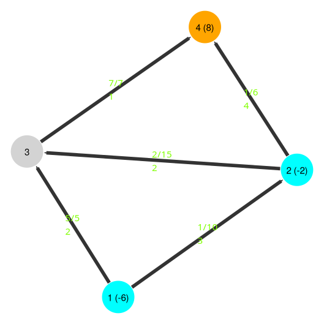
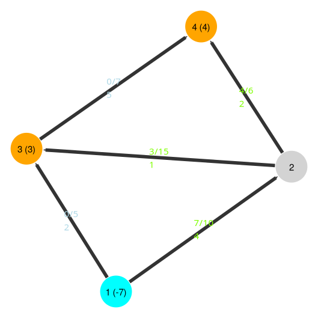
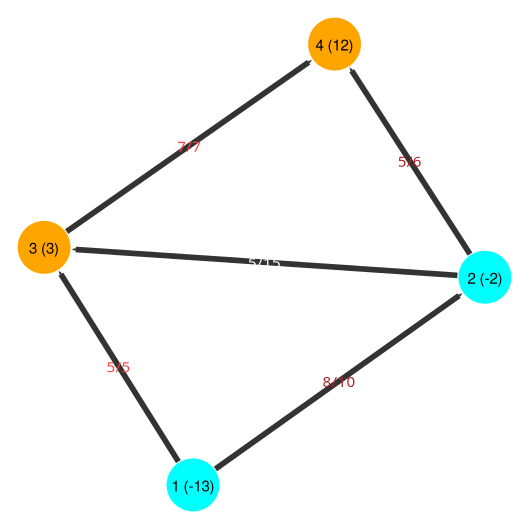

# MultiFlowSolver

[](https://dcunha95.github.io/MultiFlowSolver.jl/stable/)
[](https://dcunha95.github.io/MultiFlowSolver.jl/dev/)
[](https://github.com/dcunha95/MultiFlowSolver.jl/actions/workflows/CI.yml?query=branch%3Amaster)
[](https://codecov.io/gh/dcunha95/MultiFlowSolver.jl)


MultiFlowSolver is a package offering functionality to solve the Multicommodity Network Flow Problem (MNFP). It primarily offers a parallel Column Generation Algorithm (CGA) with decomposition in Paths and Bellman Ford's algorithm for pricing. Extra functionalities include instance generation, tuning and printing. For performance details, see the *Performance* section.

We assume nonnegative arc costs, which is reasonable for practical applications. 

The figure below showcases the solution for a toy instance with 2 commodities (see Figure 2.2 in the book [Optimizing with Column Generation](https://optimizingwithcolumngeneration.github.io/)).

Commodity 1 | Commodity 2 | Total Flow
:---:|:---:|:---:
 |  | 

## Usage

Create a `MnfpData` representing an existing instance, where `A`, `u` and `c` are the instance's arcs, flow capacities and costs: 

```julia
using MultiFlowSolver

vertex_amount::Int64 = 4
A::Vector{Tuple{Int64, Int64}} = [(1,2), (1,3), (2,3), (2,4), (3,4)]
u::Matrix{Float64} = [10 5 15 6 7]
c::Matrix{Float64} = [
    3 2 2 4 1;
    4 2 1 2 5
]
d::Matrix{Float64} = [
    -6 -2 0 8;
    -7 0 3 4
]

mnfp_instance = MnfpData(vertex_amount, A, u, c, d)
```

Call the `mnfp_cga` function to solve it:

```julia
out = mnfp_cga(mnfp_instance, max_time=1200)
out.rmlp_obj
```

The HiGHS optimizer is used by default. If another is desired, pass it as a parameter:

```julia
using CPLEX
out = mnfp_cga(mnfp_instance, max_time=1200, optimizer=CPLEX.Optimizer)
```

## Serialization

The package comes with the functions `save_mnfp`, `save_solution`, `load_mnfp` and `write_mnfp_txt`.

```julia

save_mnfp(mnfp_instance, "instance.jls")
save_solution(out.solution, "instance_solution.jls")

load_mnfp("instance.jls")

write_mnfp_txt("instance.txt", mnfp_instance)
load_mnfp("instance.txt")
```

Functions `save_mnfp`, `save_solution` are simple serialization into `.jls` objects. `write_mnfp_txt` saves the instance exclusively as a text file (note that there is a small data loss in terms of display data). Finally, `load_mnfp` reads both `.jls` files and `.txt` files.

## Random Instance Creation

Alternatively, you may generate a random `MnfpData` instance (Note that generated instances aren't guaranteed to be feasible).

```julia
mnfp_instance = generate_planar_grid_mnfp(
    vertex_amount=30,
    K=20,
    random_capacity_slack=0.5,
    base_capacity_slack=20.0,
)
out = mnfp_cga(mnfp_instance)
out.rmlp_obj
```

If an instance is too easy (or infeasible), `harden_instance` will attempt to increase its difficulty while ensuring feasibility, modifying the instance's capacity and saving it and its picture on `instance_base_path` and `instance_base_img_path` respectively.

```julia
harden_instance(
    mnfp_instance, 
    instance_base_path, 
    instance_base_img_path, 
    max_iter=200, max_time=5, 
    multi_k=mnfp_instance.k_amount < 120
)
```

With this arbitrarily large instances can be generated:


## Generating Figures

To save a figure of the instance, use the `print_mnfp_graph` function. Passing a solution will display it in the figures. 

```julia
print_mnfp_graph(mnfp_instance, solution=out.solution, file_path="all_sum.png", multi=false)
```

Be careful with the `multi` parameter. If set to `true` it will create *one file for each commodity* in the folder passed to `multi_folder` (`"mnfp_multi"` by default)

```julia
print_mnfp_graph(mnfp_instance, solution=out.solution, file_path="all_sum.png", multi=true, multi_folder="mnfp_multi")
```

## Performance

Tests were run using 1 or 12 cores, comparing a traditional flow formulation (*CPLEX*) with the implemented algorithm under several parameters setups, namely default (*CGA + Bellman F.*), with column cleaning (*CGA + Bellman F. + C.Cleaning*) and with column cleaning and enumeration (*CGA + Bellman F. + Enum + C.Cleaning*). The latter was observed to bring the most consistent results, and is thus the default.

The tables below showcase statistics and details over the total time taken to solve the instances, in seconds:

### Statistics

|      |   CPLEX |   CGA + Bellman F. |   Parallel CPLEX |   Parallel CGA + Bellman F. |   Parallel CGA + Bellman F. + C. Cleaning |   Parallel CGA + Bellman F. + Enum + C. Cleaning |
|:-----|--------:|-------------------:|-----------------:|----------------------------:|------------------------------------------:|-------------------------------------------------:|
| mean |  215    |              66    |            50    |                       11    |                                     11    |                                            10    |
| std  |  643    |             190    |           163    |                       24    |                                     22    |                                            18    |
| min  |    0.14 |               0.03 |             0.14 |                        0.02 |                                      0.02 |                                             0.02 |
| 25%  |    0.62 |               0.26 |             0.3  |                        0.08 |                                      0.41 |                                             0.39 |
| 50%  |    4.3  |               1.9  |             1.4  |                        0.58 |                                      0.9  |                                             0.85 |
| 75%  |   60    |              51    |            11    |                       14    |                                     14    |                                            14    |
| max  | 3272    |            1021    |           915    |                      113    |                                     94    |                                            72    |

### Detailed Statistics

|                   | CPLEX   |   CGA + Bellman F. |   Parallel CPLEX |   Parallel CGA + Bellman F. |   Parallel CGA + Bellman F. + C. Cleaning |   Parallel CGA + Bellman F. + Enum + C. Cleaning |    K |   V |
|:------------------|:--------|-------------------:|-----------------:|----------------------------:|------------------------------------------:|-------------------------------------------------:|-----:|----:|
| 4_2_0.0           | 0.15    |               0.85 |             0.14 |                        0.02 |                                      0.02 |                                             0.02 |    2 |   4 |
| K5_V20_D20_1b     | 0.18    |               0.04 |             0.15 |                        0.03 |                                      0.35 |                                             0.33 |    5 |  20 |
| K5_V20_D20_2b     | 0.28    |               4.8  |             0.14 |                        0.03 |                                      0.33 |                                             0.03 |    5 |  20 |
| K5_V20_D20_3b     | 0.17    |               1.8  |             0.15 |                        0.03 |                                      0.34 |                                             0.33 |    5 |  20 |
| K5_V20_D20_4b     | 0.15    |               0.05 |             0.14 |                        0.03 |                                      0.33 |                                             0.34 |    5 |  20 |
| K5_V20_D20_5b     | 0.14    |               0.03 |             0.14 |                        0.04 |                                      0.34 |                                             0.33 |    5 |  20 |
| 30_100_0.7        | 1.5     |               0.38 |             1.4  |                        0.48 |                                      0.68 |                                             0.73 |  100 |  30 |
| 50_100_0.7        | 26      |              20    |            10    |                       14    |                                     13    |                                            14    |  100 |  50 |
| L_K100_V400       | 103     |              22    |            43    |                        7.1  |                                     11    |                                            12    |  100 | 400 |
| K120_V30_D20_1b   | 0.96    |               0.08 |             0.3  |                        0.08 |                                      0.41 |                                             0.39 |  120 |  30 |
| K120_V30_D20_2b   | 0.31    |               0.07 |             0.31 |                        0.09 |                                      0.41 |                                             0.41 |  120 |  30 |
| K120_V30_D20_3b   | 4.4     |               0.08 |             0.26 |                        0.09 |                                      0.4  |                                             0.4  |  120 |  30 |
| K120_V30_D20_4b   | 0.28    |               0.08 |             0.27 |                        0.06 |                                      0.4  |                                             0.38 |  120 |  30 |
| K120_V30_D20_5b   | 1.1     |               1.4  |             0.39 |                        0.07 |                                      0.41 |                                             0.38 |  120 |  30 |
| 30_200_0.7        | 4.1     |               0.6  |             3.7  |                        0.61 |                                      0.89 |                                             2.5  |  200 |  30 |
| 50_200_0.7        | 49      |              23    |            27    |                        7.9  |                                      7.3  |                                             9.8  |  200 |  50 |
| K400_V30_D20_1b   | 0.93    |               1.9  |             0.67 |                        0.55 |                                      0.9  |                                             0.85 |  400 |  30 |
| K400_V30_D20_2b   | 0.73    |               0.29 |             0.81 |                        0.49 |                                      0.83 |                                             0.73 |  400 |  30 |
| K400_V30_D20_3b   | 1.2     |               0.26 |             0.77 |                        0.49 |                                      0.83 |                                             0.77 |  400 |  30 |
| K400_V30_D20_4b   | 7.0     |               0.28 |             0.9  |                        0.58 |                                      0.94 |                                             0.79 |  400 |  30 |
| K400_V30_D20_5b   | 0.74    |               0.26 |             0.64 |                        0.48 |                                      0.83 |                                             0.72 |  400 |  30 |
| 30_500_0.7        | 47      |               2.7  |            11    |                        4.1  |                                      4    |                                             3.9  |  500 |  30 |
| 50_500_0.7        | 416     |              42    |           131    |                       20    |                                     19    |                                            21    |  500 |  50 |
| K700_V120_D20_1b  | 44      |              68    |             6.6  |                       12    |                                     15    |                                            11    |  700 | 120 |
| K700_V120_D20_2b  | 59      |              68    |            10    |                       18    |                                     17    |                                            19    |  700 | 120 |
| K700_V120_D20_3b  | 66      |              62    |             7.7  |                       16    |                                     14    |                                            13    |  700 | 120 |
| K700_V120_D20_4b  | 64      |             106    |             7.6  |                       15    |                                     15    |                                            16    |  700 | 120 |
| K700_V120_D20_5b  | 42      |              80    |             8.6  |                       13    |                                     12    |                                            14    |  700 | 120 |
| 30_1000_0.7       | 209     |              30    |            35    |                        5.1  |                                      7.1  |                                             8.7  | 1000 |  30 |
| 50_1000_0.7       | 1614    |             133    |           209    |                       29    |                                     40    |                                            41    | 1000 |  50 |
| K2000_V200_D20_1b | 868     |            1021    |            84    |                      113    |                                     94    |                                            69    | 2000 | 200 |
| 30_5000_0.7       | 3272    |              51    |           160    |                       18    |                                     19    |                                            18    | 5000 |  30 |
| 50_5000_0.7       | -       |             460    |           915    |                       85    |                                     89    |                                            72    | 5000 |  50 |